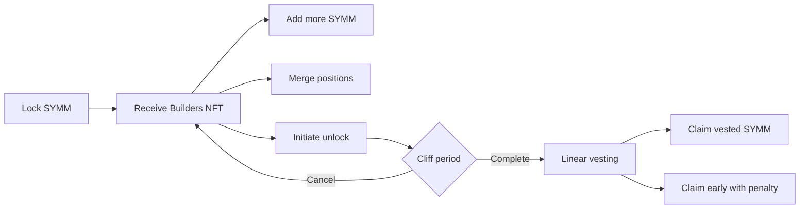

# Symmio Builders NFT

The **Symmio Builders NFT** represents a builder's locked SYMM position as a branded, transferable ERC-721. It gives products and frontends a common on-chain record of how much SYMM a builder has committed, while providing a controlled path for returning that value through a cliff and linear vesting schedule.

The system has two contracts: `SymmioBuildersNft` stores the NFT and its lock metadata, while `SymmioBuildersNftManager` runs the complete business lifecycle. The NFT is not a yield-bearing staking position by itself; external integrations may use its effective locked amount for benefits such as fee reductions or eligibility.

## The Problem It Solves

A builder program needs more than a token balance. It needs to:

- record each builder's committed SYMM and brand identity;
- allow positions to be increased, consolidated, and transferred safely;
- prevent a position from being sold while an unlock is pending;
- return value through a predictable cliff and vesting process; and
- support early exits with a transparent penalty.

Builders NFT combines these rules into one shared position and lifecycle model.

---

## What the NFT Represents

Each NFT stores:

| Field | Business meaning |
| --- | --- |
| `amount` | SYMM value still represented by the NFT |
| `unlockingAmount` | Portion reserved by pending unlock requests |
| `amount - unlockingAmount` | Effective locked amount available to integrations |
| `lockTimestamp` | NFT creation time |
| `name` | Builder or brand name |

In the normal user flow, SYMM is **burned when locked** and later **minted back when claimed**. The NFT is therefore a record of a redeemable commitment, not an escrow wallet holding the original tokens.

An authorized minter can also create a position without burning SYMM. This is useful for managed allocations, but it is economically equivalent to creating a future SYMM claim and must be tightly governed.

---

## Builder Journey

### Create and Manage a Position

- A user locks at least the configured minimum amount and receives a branded NFT.
- More SYMM can be added to an existing NFT.
- Two NFTs owned by the same user can be merged. The source NFT must have no pending unlock, is burned, and its amount moves into the target NFT.

### Unlock a Position

1. The owner selects an amount to unlock. That amount is reserved and the NFT cannot be transferred while it remains pending.
2. Before vesting starts, the owner may cancel the request and return the amount to the effective locked balance.
3. After the cliff, the owner starts a vesting flow. The amount leaves the NFT and becomes a claim owned by the address that initiated the request.
4. Vested value can be claimed without penalty. Unvested value can be claimed early, with the configured penalty sent to the penalty receiver.

If vesting is started late, its schedule still begins at the calculated cliff end, so part of the amount may already be claimable. When the NFT has no remaining amount, it is burned; its unlock history remains queryable through the manager.

---

## Ownership and Transfer Rules

The NFT can be transferred when transfers are enabled and no amount is in a pending unlock request. Unlock requests and vesting flows belong to the owner recorded when unlocking was initiated; they do not move with a later NFT transfer.

This separation allows the remaining locked position to change ownership after an amount has entered vesting, without changing the beneficiary of the existing vesting flow.

---

## Business Controls

| Control | Purpose |
| --- | --- |
| Minimum lock amount | Sets the entry threshold for new NFTs |
| Cliff duration | Defines the waiting period before vesting can begin |
| Vesting duration | Defines how long new flows release linearly |
| Early-claim penalty | Discourages claiming unvested value |
| Penalty receiver | Receives the deducted early-claim amount |
| Pause controls | Stop manager operations and NFT mutations/transfers together |

The current implementation recalculates the cliff of pending requests from the latest global cliff duration. A cliff update can therefore change an already initiated request. Started vesting flows keep their recorded start and end times.

---

## Roles and Trust

| Role | Business authority |
| --- | --- |
| Admin | Grants and revokes all roles |
| Setter | Changes the minimum lock, cliff, and vesting durations |
| Minter | Creates NFT value without burning SYMM |
| Operator | Claims vested or unvested value on behalf of a beneficiary |
| Pauser / Unpauser | Stops or resumes the system |

The minter and the NFT's metadata-management permissions are part of the SYMM supply boundary because created NFT value can later be claimed as SYMM. The operator role is also custodial: it can trigger an early claim and its penalty for a user. These roles should be assigned only to appropriately secured governance or operational accounts.

