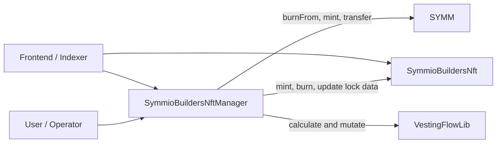

# Symmio Builders NFT — Technical Architecture

The Builders NFT system separates the user-facing ERC-721 record from the state machine that manages SYMM locking, unlock requests, linear vesting, and claims. `SymmioBuildersNftManager` is the orchestration and accounting contract; `SymmioBuildersNft` remains a small storage and transfer-policy contract.

## Components

| Component | Responsibility |
| --- | --- |
| [`SymmioBuildersNftManager`](../SymmioBuildersNftManager.sol) | Locking, minting, merging, unlock requests, vesting flows, claims, configuration, and aggregate views |
| [`SymmioBuildersNft`](../SymmioBuildersNft.sol) | ERC-721 ownership/enumeration, lock metadata, mint/burn, and transfer restrictions |
| [`ISymmioBuildersNft`](../interfaces/ISymmioBuildersNft.sol) | Narrow interface used by the manager |
| [`VestingFlowLib`](../libraries/VestingFlowLib.sol) | Linear vesting calculation and flow mutation |
| SYMM token | `burnFrom` on user locks; `mint` and ERC-20 transfers on claims |



---

## State Ownership

### NFT State

`SymmioBuildersNft` stores one `LockData` record per token:

```solidity
struct LockData {
    uint256 amount;
    uint256 lockTimestamp;
    uint256 unlockingAmount;
    string name;
}
```

`amount` is principal still represented by the NFT. `unlockingAmount` is the subset assigned to pending unlock requests. The effective locked amount is `amount - unlockingAmount`.

### Manager State

The manager owns the lifecycle records:

- `UnlockRequest` snapshots the amount, initiating owner, token ID, timestamps, linked flow ID, and `netClaimedAmount`.
- `Flow` stores the originating request ID, remaining amount, and current linear-vesting segment.
- `tokenUnlockIds` links NFTs to their non-cancelled request history.
- `_userFlowIds` tracks active flows for pagination and aggregate views.
- `totalVested` tracks the remaining principal across active flows.

`netClaimedAmount` is the amount actually transferred to the beneficiary. It includes normal vested claims and the post-penalty portion of early claims, but excludes penalties.

---

## Lifecycle and Accounting

| Transition | NFT state | Manager state | SYMM action |
| --- | --- | --- | --- |
| `mintAndLock` | Mint NFT with `amount` | None | Burn user's SYMM |
| `mintWithoutBurn` | Mint NFT with `amount` | None | No burn; authorized role only |
| `lockIntoNFT` | Increase `amount` | None | Burn user's SYMM |
| `initiateUnlock` | Increase `unlockingAmount` | Create request | None |
| `cancelUnlock` | Decrease `unlockingAmount` | Delete request | None |
| Start vesting | Decrease both fields by request amount; burn empty NFT | Create flow; increase `totalVested` | None |
| Claim vested | Unchanged | Shrink/clear flow; decrease `totalVested`; increase net claimed | Mint deficit, transfer to beneficiary |
| Claim early | Unchanged | Reduce/clear flow by gross amount; decrease `totalVested`; increase net claimed | Mint deficit, split beneficiary amount and penalty |
| Merge | Add source amount to target; burn source | Unlock history remains with original token IDs | None |

An unlock request may be cancelled only before vesting starts. Starting vesting uses:

```text
startTime = unlockInitiatedTime + current cliffDuration
endTime   = startTime + current vestingDuration
```

Because the schedule starts at the cliff end rather than the completion transaction time, a late completion creates a flow with an immediately vested portion. The start and end times are then stored in the request and flow.

---

## Vesting Model

For an active flow, `VestingFlowLib.unlocked()` returns:

```text
0                                      when now <= startTime
amount                                 when now >= endTime
amount * (now - startTime)
-------------------------------------  otherwise
          endTime - startTime
```

After a vested claim, `shrink()` removes the vested amount and advances `startTime` to the current block timestamp. An early claim first accounts for vested value, then `decreaseLockedAmount()` removes unvested principal. Clearing a flow deletes its state and removes its ID from the user's active-flow list using swap-and-pop.

The intended per-request conservation relationship is:

```text
original request amount
= net amount received by beneficiary
 + penalties paid
 + remaining flow amount
```

---

## Permissions and Contract Wiring

### Manager Roles

| Role | Functions |
| --- | --- |
| `DEFAULT_ADMIN_ROLE` | Role administration |
| `SETTER_ROLE` | `setMinLockAmount`, `setCliffDuration`, `setVestingDuration` |
| `MINTER_ROLE` | `mintWithoutBurn` |
| `OPERATOR_ROLE` | `claimUnlockedTokenFor`, `claimLockedTokenFor` |
| `PAUSER_ROLE` | Coordinated manager/NFT pause |
| `UNPAUSER_ROLE` | Coordinated manager/NFT unpause |

The initializer grants all manager roles to the initial admin. The penalty rate and receiver are set during initialization and have no setter in the current version.

### Required External Permissions

For the integration to operate, the manager must hold the NFT's:

- `MINTER_ROLE` for minting and `updateLockData`;
- `BURNER_ROLE` for merges and empty-position cleanup;
- `PAUSER_ROLE` and `UNPAUSER_ROLE` for coordinated pause control.

The manager must also be authorized to mint SYMM when its balance cannot cover a claim. Users must provide whatever allowance the SYMM implementation requires for `burnFrom` before locking.

---

## Transfer and Ownership Semantics

`SymmioBuildersNft._update()` blocks address-to-address transfers when the NFT is paused, transfers are independently paused, or `unlockingAmount > 0`. Minting and burning bypass these transfer-only checks.

Flow authorization does not depend on the NFT's current owner. Each `Flow.reqId` resolves to an `UnlockRequest.owner`, and all claim paths validate that beneficiary. Once a request enters vesting and its amount leaves the NFT, the remaining NFT can transfer without moving the existing claim.

---

## Read Model

Frontends can use:

- `getTokenDetails(tokenId)` for owner plus enriched unlock/vesting history;
- `getUnlockedRequests(tokenId, start, size)` for paginated raw requests;
- `getUserFlows(user, start, size)` and `getUserFlowCount(user)` for active-flow pagination;
- per-flow and per-user locked/claimable amount views;
- NFT enumeration and effective locked amount views.

`getTokenDetails` returns a zero owner for a burned NFT while preserving its request history. It is not paginated, so integrations should prefer paginated functions for accounts or tokens with large histories. Swap-and-pop removal also means request and active-flow ordering is not stable.

---

## Safety and Trust Boundaries

- User-facing state transitions are protected by `whenNotPaused` and `nonReentrant`.
- Claim accounting is updated before ERC-20 transfers, and transfers use `SafeERC20`.
- `unlockingAmount` cannot exceed the NFT's total `amount`.
- Manager pause/unpause also pauses/unpauses the NFT when role wiring is correct.
- Pending requests use the current global `cliffDuration`; changing it changes their effective deadline.
- `OPERATOR_ROLE` can initiate penalized early claims for beneficiaries and must be treated as custodial.
- Manager and NFT mint/update permissions can create future SYMM claims and are part of the token-supply security boundary.
- Per-token request history and per-user active-flow arrays can grow without a protocol-level bound; callers should use paginated views where available.

