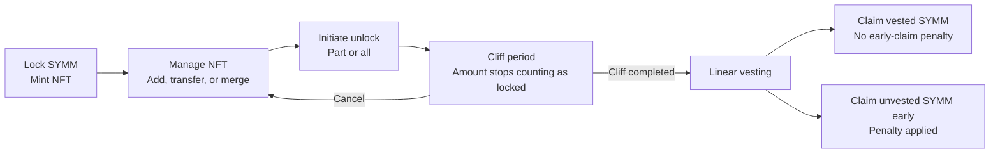

# Symmio Builders NFT: Business Overview

The **Symmio Builders NFT** represents a user's locked SYMM as a user-owned, on-chain NFT. A user can mint an NFT by locking SYMM, increase or consolidate the position, transfer it when eligible, and unlock part or all of it through a cliff and linear vesting process.

The NFT exposes an **effective locked amount** that other products can use for fee reductions, access, rewards, reputation, or other benefits. The Builders NFT contracts provide the shared on-chain record; each integration decides how to use it.

## User Journey

### 1. Mint an NFT by Locking SYMM

The user selects an amount that meets the current minimum, chooses a builder or brand name, and receives an ERC-721 NFT. The NFT records the position's name, total amount, original lock time, and any amount currently being unlocked.

In the standard flow, the locked SYMM is burned rather than stored inside the NFT. When SYMM is later claimed through vesting, the manager funds the claim and mints any required balance deficit.

### 2. Manage the NFT Position

The user can:

- add more SYMM to increase an existing position;
- transfer an NFT that has no pending unlock;
- merge two owned NFTs into one larger position; and
- view individual NFT balances and the total effective locked amount across their NFTs.

When two NFTs are merged, the selected target NFT remains and the source NFT is burned. The target keeps its builder or brand name. A source NFT with an active unlock cannot be merged.

### 3. Start or Cancel an Unlock

The user can unlock part of the position or its full available balance. The selected amount immediately stops counting toward the NFT's effective locked amount and enters the protocol-configured cliff period.

While an unlock is pending:

- the NFT cannot be transferred;
- no SYMM from that request is claimable; and
- the user can cancel the request and return the full amount to the NFT.

Cancellation remains available until vesting starts, even if the cliff has already ended. A user can also create multiple unlock requests against one NFT when enough available balance remains; each request is tracked separately.

The deployment-level per-user cap counts both pending unlock requests and active vesting flows. Starting vesting does not release the cap slot; the slot is released only when the request is cancelled before vesting or the vesting flow is fully settled.

### 4. Start Vesting and Claim

After the cliff, the user explicitly starts linear vesting. The selected amount leaves the NFT balance and becomes a separate vesting flow.

The schedule begins from the end of the cliff. If the user starts vesting later, the elapsed portion is already vested and may be claimed immediately.

The user can then:

- claim vested SYMM without an early-claim penalty;
- wait for more SYMM to vest; or
- claim some or all unvested SYMM early and pay the configured penalty on that portion.

If the entire NFT balance enters vesting, the empty NFT is burned while its unlock history remains available. If a balance remains, the NFT can be managed again once it has no other pending unlocks.

## What Users and Integrations Can See

- NFT ownership, builder or brand name, and recorded amount.
- Effective locked amount after excluding pending unlocks.
- Unlock requests, cliff timing, and vesting schedules.
- Currently vested, claimable, and unvested amounts.
- Claim history, including for an NFT that was burned after a full exit.

## Key Rules

- The address that initiates an unlock owns its vesting flow and claim rights.
- Those claim rights do not move with a later transfer of the remaining NFT.
- The early-claim penalty and receiver are fixed in the deployment configuration for the current version.
- Authorized protocol accounts can mint NFTs without the standard SYMM burn.
- Protocol roles can update locking and timing rules or pause the system when required.
